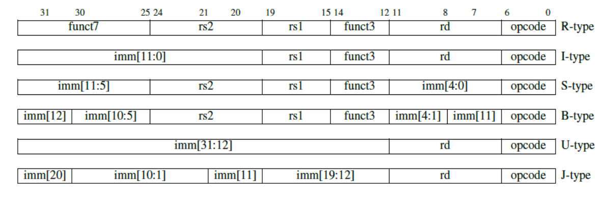

# VexRiscv 简单解析（零）：先从一个简单的 riscv 核开始

[VexRiscv](https://github.com/SpinalHDL/VexRiscv) 是一个开源的 Riscv 处理器。和其他开源处理器相比，VexRiscv 最大的亮点在于其大概是目前最强大的参数化能力和添加自定义扩展指令的能力。使用的是 CHISEL 家族中大概是生成代码可读性最高的 SpinalHDL 编写而成。目前已开源的部分支持RV32I/E[M][A][F[D]][C][B][K]（中括号内为可由参数控制是否生成）。

虽然 VexRiscv 是一个质量非常高的开源代码，也是 github 上 star 数前几的 riscv 处理器，但似乎有很多人在阅读 VexRiscv 代码上存在一些困难，因此本系列文章的主要目的就是帮助缕清代码的脉络。笔者能力有限，难免会有错误，望各位大佬指正。

本系列文章适合对 spinalhdl 有一定基础的使用者阅读。

在对 Riscv 的 cpu 架构不太了解的情况下直接看 VexRiscv 的代码比较困难，因此先让我们看看一个相对简单一些的 riscv cpu 的代码。这个代码在 SpinalHDL 的 lib 库中 [**代码链接**](https://github.com/SpinalHDL/SpinalHDL/blob/dev/lib/src/main/scala/spinal/lib/cpu/riscv/impl/RiscvCore.scala)

虽然这个代码和传统的五级流水线的 cpu 略有区别，但功能是完整的。得益于 SpinalHDL 语言的清晰简洁高效，这个代码十分适合于学习基础的 riscv cpu 设计。

## 参数及接口

前面一大段主要是接口定义啥的，让我们直接跳到 475 行看顶层模块。

```scala
class RiscvCore(implicit val c : RiscvCoreConfig) extends Component{
  import c._
```

`implicit val` 隐式值，调用它的时候不需要写出来，会自动去找你定义的值。效果如下：

```scala
SpinalVhdl{
      implicit val p = RiscvCoreConfig(
        ...
      )
      (new RiscvCore).setDefinitionName("TopLevel")
    }
```

如果只是一般的 `val` 的话则需要：

```scala
SpinalVhdl{
      val p = RiscvCoreConfig(
        ...
      )
      (new RiscvCore(p)).setDefinitionName("TopLevel")
    }
```

此外， `RiscvCore` 内有不少通过这个隐式值传递的 config，如果改用一般的 `val` 全都要像上面这样显式调用，会麻烦许多。不过，这种采用隐式值传递参数可能会存在一些问题，在之后分析 VexRiscv 的文章中我们会看到一个优秀的架构是如何设计清晰优雅的参数配置的。

`import c._` 的作用是后续在调用 c 里的内容时（例如调用 pcWidth），可以直接写 `pcWidth` 而无需写 `c.pcWidth`。

接下来是定义指令总线和数据总线：

```scala
  //Instruction bus
  val iCmd = Stream(CoreInstructionCmd())
  val iRsp = Stream(CoreInstructionRsp())

  //Data bus
  val dCmd = Stream(CoreDataCmd())
  val dRsp = Stream(Bits(32 bits))
  val dataBusKind : DataBusKind = if(c.extensions.foldLeft(false)(_ || _.needFlowDRsp))
    cmdStream_rspFlow
  else
    cmdStream_rspStream
```

cpu 通过 Instruction bus 获取需要执行的指令，通过 data bus 与存储器交互数据。其中 `cmd`(command) 表示命令，`rsp`(response) 表示响应。dataBus 可以是 Stream 信号也可以是 Flow 信号（相当于 ready 始终为高的信号），因此定义一个 dataBusKind 方便后续处理 ready 信号。

具体看看总线内容：

```scala
case class CoreInstructionCmd()(implicit p : RiscvCoreConfig) extends Bundle{
  val pc = UInt(p.addrWidth bit)
}

case class CoreInstructionRsp()(implicit p : RiscvCoreConfig) extends Bundle{
  val instruction = Bits(32 bit)
  val pc = UInt(p.addrWidth bit)
  val branchCacheLine = if(p.branchPrediction == dynamic) BranchPredictorLine() else null
}
```

* `pc(Program Counter)`：指令计数器，也就是取指令的地址
* `instruction`：取到的指令
* `branchCacheLine`：分支预测的记录，具体作用会在下文详细阐述

回到 RiscvCore 部分，IRQ（Interrupt ReQuest）中断请求，这部分我没仔细看，好像不是特别重要，先放放。Memories 部分包含一个寄存器和一个分支记录存储器。分支记录这个放在后文分支跳转部分一起说明。寄存器是 cpu 内核的基本组件，不同指令集设计的寄存器也不同，32 位 Risc-V 指令集设计的寄存器有 32 个，每个 32 比特。

接下来就是各个阶段的行为了，每个阶段一个 clk。

## prefetch

prefetch 阶段主要完成的是计算取指令的地址 `pc`。基础的 RV32I 指令是 32 位的，也就是 4 个字节，因此在程序正常顺序执行时，每次指令地址加 4 即可。但当遇见无条件跳转指令（Jump & Link）和条件分支指令（Branches）时指令地址则需要随之改变。这一阶段并未处理遇见条件指令时的需要跳转到的地址，仅定义了 `pcLoad` 信号，具体行为在完成所有阶段的操作后才完善。

地址加 4 部分的代码有两种实现：

```scala
val pcNext = if(fastFetchCmdPcCalculation){
      val pcPlus4 = pc + U(4)
      pcPlus4.addAttribute("keep")
      Mux(inc,pcPlus4,pc)
    }else{
      pc + Mux(inc,U(4),U(0))
    }
```

两种参数对应的电路的区别如下：


这里右图更省面积（Mux 的位宽更小）但时序可能更差（当 inc 信号到的比较晚时，左图时序最差的是 inc+Mux，右图还多个加法），因此留个参数自行调整。

## fetch

该阶段和 prefetch 可以算作一个阶段。该阶段主要处理的是将取到的 iRsp 传递给下一阶段。给下一阶段的信号定义为 `outInst`，其中包含握手用的 valid 和 ready、下一级要用的 pc instruction 和 branchCacheLine。其中，pc、instruction 直接传递下一级，branchCacheLine 虽然涉及到有关分支预测的参数，但正如注释所说分支预测不设为 dynamic 的时候无需关心，因此该阶段需要关注的仅有使能的控制。使能的控制需要处理的逻辑很简单，就是发现该跳转却没跳转时，把收到的错误的指令抛去。prefetch 阶段并不能知道是否需要跳转，获取并处理好指令需要数个 clk，此时 prefetch 阶段的地址计算已经在错误的道路上跑了好少，这里定义的 flush 信号表示的就是发现该错误。此时 fetch 阶段能做的事有两件：把当前拿到的错误指令丢弃（throwIt），和把 prefetch 已经发出请求但尚未到达的指令也丢弃（throwRemaining）。至于已经收到且发到后面阶段的指令，fetch 阶段也无能为力了，只能其他阶段自行处理。

## decode

译码阶段。RiscV 的 32 位指令共有六种类型：



图片来源 [RISCV手册](http://crva.ict.ac.cn/documents/RISC-V-Reader-Chinese-v2p1.pdf)

最上面一行的数字表示位数，一共 32 位。以 R-type 为例，0 到 6 位是 opcode，7 到 11 位 rd，12 到 14 位 funct3，15 到 19 位 rs1，20 到 24 位 rs2，25 到 31 位 funct7。具体含义如下：

* opcode、funct3、funct7：表示需要执行的操作。以 add（加法）指令为例，该指令和 sub（减）、and（逻辑与）、sll（逻辑左移）等同属于 opcode 为 0110011 的整数计算。add 和 sub 又同属于 funct3 为 000 的操作。add 的 funct7 为全 0。
* rd：cpu 的大部分操作都是在寄存器上进行的，rd 表示的是完成操作后把结果存在哪个寄存器上。因为 RiscV 中有 32 个寄存器（2 的 5 次方），因此需要 5 比特地址位。
* rs1 和 rs2：表示操作数从哪个寄存器来的地址位
* imm：立即数。操作数可以不从寄存器来，可以写死在指令中，也就是立即数。

## execute0

执行阶段

## execute1


## writeback

写回阶段，


本文档基于 CC-BY-SA 4.0 发布，文中引用代码来源于 SpinalHDL 的 lib 部分，为 MIT 协议。绘图使用 draw.io 的非官方 vscode 插件。
